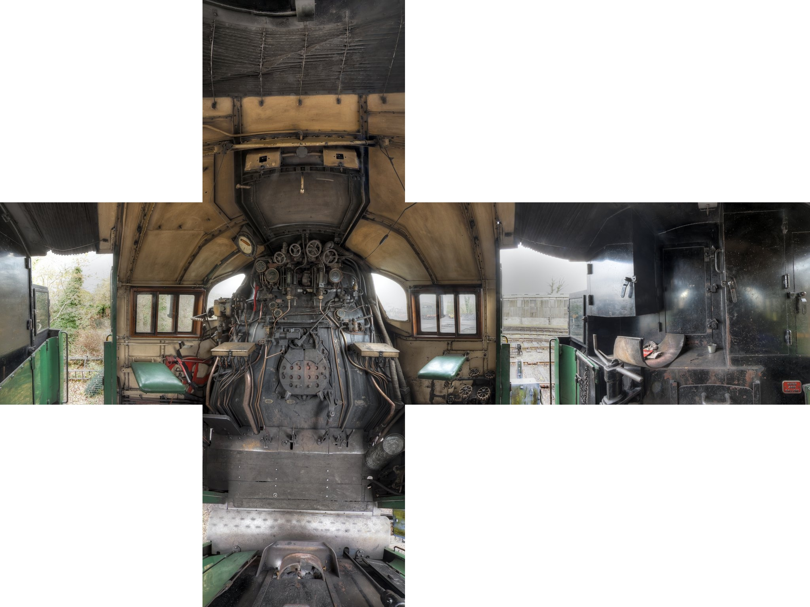
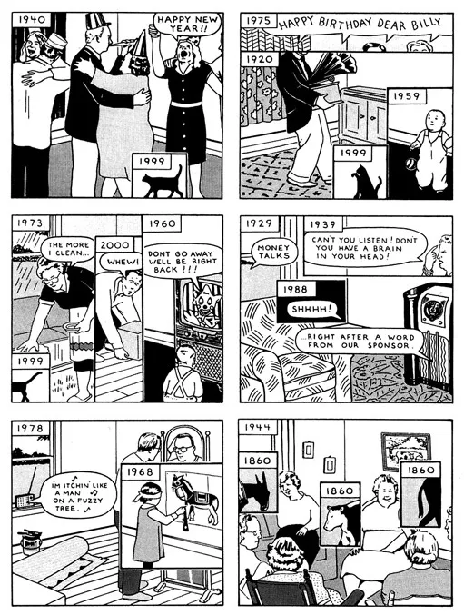

# Museo Virtual de Matemáticas

Este museo pretende albergar distintas web-apps dispuestas en distintas salas, con curaduría, interactividad y la posibilidad de profundizar más con artículos en "blocks de notas" interactivos y editables. Las salas del museo serán temáticas, por orientación etérea, etc. y contendrán 5 apps cada una. El formato de las salas será de navegación 360° en base a fondos equirectangulares dibujados a mano sobre guías de estructuras creadas como objetos 3D en ordenador.

## Plantilla vacía para crear una Web App

**versión 0.5**

El template de Progressive We App (vacío) se puede descargar desde la carpeta:

- **[app/](app/)**.

## Salas 3D

Se puede ver una demostración de las salas 3D en el siguiente enlace:

- **[salas/](https://sanxofon.github.io/mvm/salas/)**

### Resolución de las imágenes de fondo para las salas 360

Todas las imágenes equirectangulares tienen la proporción 2x1. Las imágenes deben tener un tamaño del doble de ancho que de alto.

El despliegue 360 de las imágenes equirectangulares utiliza un proceso de visualización que carga cada área de la esfera que el usuario esté viendo a partir de pequeños mosaicos (tiles), que son pedazos de la imagen de 512x512 pixeles cada uno.

La imagen se recorta en varios cuadraditos y depende del tamaño de la imagen en cuántos cuadraditos de 512x512 se puede llegar a cortar.

Si la imagen tiene suficiente resolución se pueden crear más niveles de profundidad de 1 hasta 4 lo cual permite al usuario acercarce más a la imagen haciendo zoom.

- El nivel 1 genera 6 mosaicos siendo cada uno de ellos un lado del cubo interior.

- El nivel 2 genera 24 imágenes, cuatro para cada cara del cubo.

- El nivel 3 genera 96 mosaicos, 16 mosaicos por cara del cubo.

- Por último, el nivel 4 de zoom genera 384 mosaicos, con 64 mosaicos por cara.

Subí unos ejemplos de diferencias de resolución con imágenes de internet de más a menos resolución.

**3 Niveles**

  1. maquina-9000x4500 [Ver 360](salas/#1-maquina-9000x4500) / [Ver imagen original](er/maquina-9000x4500.jpg)

**2 Niveles**

  1. gato-3000x1500 [Ver 360](salas/#5-gato-3000x1500) / [Ver imagen original](er/gato-3000x1500.jpg)

**1 Nivel**

  1. dibujo-2500x1250 [Ver 360](salas/#6-dibujo-2500x1250) / [Ver imagen original](er/dibujo-2500x1250.jpg)
  2. esferas-1600x800 [Ver 360](salas/#7-esferas-1600x800) / [Ver imagen original](er/esferas-1600x800.jpg)
  3. penta-1600x800 [Ver 360](salas/#8-penta-1600x800) / [Ver imagen original](er/penta-1600x800.jpg)

### Barcos 3D

Se pueden ver varios barcos en 3D en el siguiente enlace:

- **[salas/barcos/](https://sanxofon.github.io/mvm/salas/barcos/)**

Las imágenes originales equirectangulares se pueden [ver acá](https://github.com/sanxofon/mvm/tree/master/er/barcos).
  
### Tipos de proyección posibles para generar esquemas

Hay dos tipos de proyección posibles para generar las imágenes o los esquemas 3D.

#### Equirectangular

Esta forma ocupa toda la extensión de la imagen para guardar pixeles. Es contínuo y muestra las rectas como curvas.

#### Las 6 caras de un cubo

Se trata de 6 imágenes cuadradas. Cada una de ellas es la vista plana en una dirección. Arriba, abajo, izquierda, derecha, atrás y adelante. Cada imagen el plana y rectilíne pero los ángulos cambian de cara a cara del cubo.

### Algunas propuestas de fondos

La propuesta se puede [ver acá](docs/Propuestas_junio_MVM.md) y algunas de las ideas más interesantes fueron:

. El interior de un objeto pequeño
. La línea del horizonte en el agua
. Insectos
. Una cocina / laboratorio
. Cabina de piloto
. Escaleras esherianas

### Ideas generales

Usar recuadros de imágenes como en el ejemplo (como idea, no el estilo):

---

